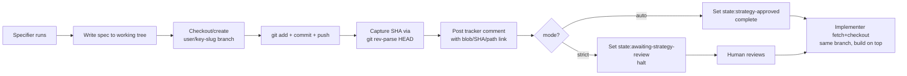

# /design: commit spec on impl branch + use commit-SHA permalink in tracker comment

## Goal

Make the spec link in `/design`'s tracker comment resolve immediately — and forever — by committing the spec on the eventual implementer branch and linking via commit-SHA permalink. Eliminate the `blob/main/...` 404 window that exists today on branch-protected repos.

## Approach

The specifier agent today writes the spec to a working-tree file and posts a tracker comment whose link points at `blob/main/<path>` — a link that 404s until something else gets the file onto `main`. The revised acceptance (per dugshub's superseding comment) is to drop the separate "docs PR for the spec" idea entirely: a commit-SHA permalink works regardless of whether a PR exists, so the specifier just needs to commit the spec on the **branch the implementer will eventually use** and link via that SHA.

Three mechanical changes, all in `plugin/agents/specifier.md` (no canvas changes, no `sdlc.yml` changes):

1. **Compute the impl branch name early** — same convention the implementer uses today (`plugin/agents/implementer.md:85`, `plugin/primitives/task-management/github.md:60-61`): `<user>/<issue-key-lowercase>-<slug>`. The specifier derives this from the issue title (3–4 word kebab-case slug) and the local git user (`git config user.name`-derived `<user>` segment, lowercased).
2. **Commit-on-branch step** inserted between "Write the durable spec" (existing Step 3) and "Tracker comment" — checkout (or create) the branch, stage the spec file, commit with the canonical scope, push the branch to `origin`. Capture the resulting commit SHA from `git rev-parse HEAD`.
3. **Permalink the tracker comment** — replace the `blob/<default_branch>/<path>` URL construction in the spec link with `blob/<full-sha>/<path>`. Everything else about the comment shape stays governed by `plugin/canvases/spec/instructions.yaml`.

The implementer side requires a tiny accommodation: Step 4 of `plugin/agents/implementer.md` ("Set up the branch") must check out the existing branch (already on `origin` with the spec commit on it) rather than `git checkout -b` from `main`. Re-run idempotency is already handled — `implementer.md:94` says "If the branch already exists, switch to it" — so the change is to detect the remote branch and `git fetch && git checkout <branch>` before falling back to the create path.

Status moves stay label-driven (no change to gate semantics). Strict mode still sets `state:awaiting-strategy-review` and halts; auto mode still sets `state:strategy-approved` and completes. Pushing the branch is gate-orthogonal.



## File-level plan

### Create

None. This issue is a behavior change inside the existing specifier agent; no new files.

### Modify

- **`plugin/agents/specifier.md`** — primary surface. Add a new instruction Step 4 ("Commit on impl branch") between current Step 3 ("Write the durable spec", lines 109–113) and the existing Output Format § "Tracker comment" (line 140). Update the "Tracker comment" section (lines 140–154) so the URL construction example uses `blob/<full-sha>/<path>` not `blob/<default_branch>/<path>`. Add a Constraint forbidding `blob/main/...` for newly-written specs. Update Step 3 to keep producing the working-tree write (commit comes after).
- **`plugin/agents/implementer.md`** — Step 4 ("Set up the branch", lines 83–95). Change the branch flow from "checkout main → pull → checkout -b <branch>" to a remote-aware sequence: `git fetch origin <branch>` → if remote ref exists, `git checkout <branch>` (picks up the spec commit); else fall back to the current create-from-main path. Update Step 5 ("Implement the spec") so it explicitly acknowledges the spec commit may already be on the branch — work builds on top, no rewrite of the spec commit.
- **`plugin/agents/specifier.md` frontmatter** — `produces:` currently lists `[spec, comment, label]`. Add `branch` and `commit` so downstream agents and the envelope schema reflect the new artifacts. Tool surface (`disallowedTools: WebFetch, WebSearch, Agent`) already permits Bash (per `sdlc.yml:98` `spec_writer_mcp` denylist note: "Bash kept — required by github adapter"), so no tool-group change is needed.
- **`plugin/commands/design.md`** — Step 2 "Strategize" mission lines 67–73: extend `Output:` to include the impl branch + spec commit SHA in addition to spec file + comment + label. Update the example "Output" block (lines 80–88) so it lists the branch + permalink URL alongside `state:awaiting-strategy-review`. No new steps in the command itself — orchestration stays inside the specifier per the revised Option A.

## Interfaces

No code interfaces (TypeScript types / signatures / schemas). The behavior contract is the **specifier agent prompt** plus the **shape of the tracker comment URL**:

```typescript
// Conceptual shape — not an emitted type. Documents the URL contract the
// specifier now emits in the tracker comment and the envelope.

interface SpecArtifactRef {
  /** Always-resolving link to the spec at the SHA the specifier committed it. */
  permalinkUrl: string;            // e.g. https://github.com/<owner>/<repo>/blob/<full-sha>/.ai-docs/specs/67.md
  /** Repo-relative path. */
  path: string;                    // e.g. .ai-docs/specs/67.md
  /** 40-char SHA — captured from `git rev-parse HEAD` after the spec commit. */
  commitSha: string;
  /** Branch the implementer will pick up (already pushed to origin). */
  branch: string;                  // e.g. dug/67-design-commit-permalink
}

// Envelope additions (extend the existing `artifact` field in the specifier's emitted envelope):
interface SpecifierEnvelopeArtifactAddendum {
  branch: string;                  // new — picked up by implementer
  commitSha: string;               // new — for permalink reconstruction by other consumers
}
```

Commit message (scope-by-issue-key, per `plugin/primitives/commit/conventional.md` and the github adapter §"Issue identifier in branches and commits"):

```text
docs(#67): add spec for /design commit-on-branch permalink

Spec written by specifier; awaiting human Gate-1 review.
```

## Tests

This is an agent-prompt change (no compilable code), so the validation surface is **behavioral**, executed by running `/design` against a fresh issue and inspecting outcomes. The PR test plan:

1. **Permalink-resolves-immediately test** — pick a fresh test issue (e.g. open a throwaway issue in `pattern-stack/claudecode-patterns`). Run `/design <key>`. Click the spec link in the tracker comment within seconds of posting. Expected: page loads, file content visible. Failure today: 404. Pass criterion: 200 OK, content matches the just-written spec.
2. **Permalink-survives-merge test** — after running step 1, run the implementer (`/develop` or `/implement`) to completion + merge the resulting PR. Re-click the original tracker comment link. Expected: 200 OK (SHA permalinks survive branch deletion and main fast-forward).
3. **Implementer-picks-up-branch test** — after `/design`, run the implementer. Inspect `git log <branch>` and the resulting PR diff. Expected: spec commit is the **first** commit on the branch (specifier's), implementation commits stack on top, single PR contains both.
4. **Re-run idempotency** — run `/design` twice on the same issue. Expected: second run detects the branch already exists, either amends the spec commit OR adds a new "update spec" commit (decide in the spec — see Open questions). No detached HEADs, no force-push to a branch that already has implementer commits on it.
5. **Strict-vs-auto mode invariance** — re-run tests 1–3 with `gate:auto` applied. Expected: identical branch + commit + permalink behavior; only the state label differs (`state:strategy-approved` vs `state:awaiting-strategy-review`).
6. **Branch-protected-main safety** — verify the specifier never pushes to `main`. Add a guard / assertion in the prompt: refuse to commit if `git branch --show-current` resolves to `main` after the checkout step.

No unit tests added — there is no testable code unit. If we later extract branch-name + commit-message generation into a `plugin/scripts/specifier-helpers.sh` (out of scope here), a shellspec/bats test would attach there.

## Out of scope

- Auto-merging the spec commit / opening a separate spec PR — explicitly dropped by the revising comment.
- Patching existing tracker comments that already contain `blob/main/...` links — leave history alone; only new `/design` runs use permalinks.
- Updating non-`/design` tracker references (e.g. links to `tsconfig.json` or sibling files that already live on main) — those `blob/main/...` URLs stay correct.
- Changing the implementer's PR-creation flow (`gh pr create --draft`, `Closes <ISSUE-KEY>` body) — unchanged; the PR still carries the full branch including the spec commit.
- Linear / Jira adapters — github-only fix today. Linear's comment-link contract has no equivalent failure mode (Linear specs link via Linear's own URL, not GitHub blob). When/if we revive Linear, mirror the convention.

## Open questions

- **Re-run on existing branch with implementer commits already present** — does the specifier amend the spec commit (rewriting history the implementer is built on, requiring force-push), or add a new `docs(#N): update spec` commit on top? Recommendation: **append a new commit**. Force-pushes through other agents' work are hostile. Confirm before implementing.
- **Branch slug derivation** — should the specifier compute the slug from the issue title (mirror the implementer's current behavior) or accept it as an optional `$2` argument to `/design`? Recommendation: **compute from title; no new arg**. Keeps `/design` single-input.
- **`<user>` segment of the branch name** — implementer's primitive docs show `<owner>/<n>-<slug>` (github.md:60). On a single-developer repo this is `git config user.name` lowercased. On shared repos, do we want a consistent literal like `spec` or `bot`? Recommendation: **match `git config user.name` lowercased to stay consistent with implementer's existing convention** — branch ownership stays per-human.
- **Pre-push hook collisions** — if the repo has a pre-push hook that runs typecheck/tests, a `docs(#N): add spec` commit may fail to push (typecheck on a docs-only change should pass; tests may run anyway). Decision: **fail loud** — surface the hook error to the human; don't skip hooks. Aligns with the "Never skip hooks" guidance in the global plugin contract.
- **Should this issue join the `sdlc-plugin-distribution` stack?** The change is plugin-internal (specifier/implementer agent prompts under `plugin/`) and touches the same agent surface as the active stack. Recommendation: **leave on legacy_spec path for this run** (matches the assignment input), but consider folding into the stack via a `/plan` revision if a related issue lands.
- **Envelope schema change** — adding `branch` + `commitSha` to the specifier's `artifact` field is a backwards-compatible additive change, but the envelope canvas schema (`plugin/canvases/envelope/instructions.schema.json`) may need a minor update. Verify before opening the PR.
