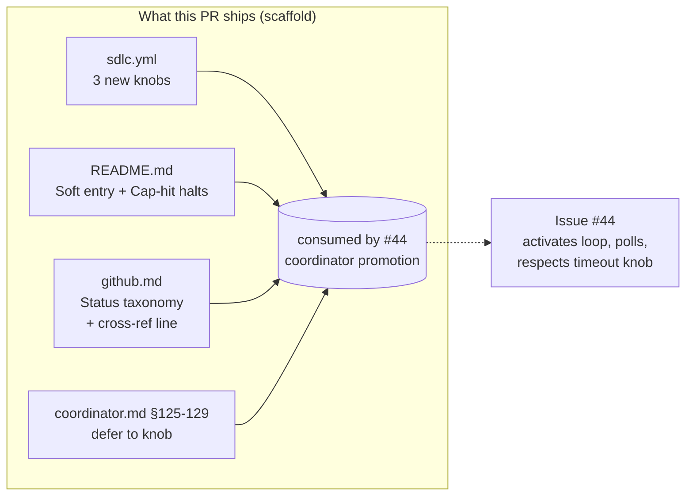

# sdlc.yml knobs + port-level soft-entry & cap-hit conventions

## Goal

Lay the contract surface that issue #44 (coordinator promotion) consumes: three
new `sdlc.yml` knobs with sane defaults, two new port-level conventions
documented in `primitives/task-management/README.md`, and a one-line
cross-reference in `github.md`'s Status taxonomy. Plus a prose touch-up in
`coordinator.md` so its self-block section defers to the new timeout knob
instead of hard-coding it.

This is **scaffold-only**. No agent loop changes, no behavior changes — the
knobs exist with default values that preserve current behavior; the
conventions document patterns specifier already uses; the coordinator edit is
a doc-fix that prepares the soil for issue #44's surgery.

## Approach

### Mirroring resolution (was the open question in handoff)

Verified: `.claude/<dir>` directories are **symlinks** to `plugin/<dir>`
(see `~/.claude/.../memory/project_plugin_distribution.md` lines 22-30, and
the README's plugin dogfood line). Concretely:

- `.claude/primitives/` → symlink to `../plugin/primitives/`
- `.claude/agents/` → symlink to `../plugin/agents/`
- `.claude/sdlc.yml` is **not** symlinked — it is the project-local config
  file, authored per-project. The plugin ships `plugin/sdlc.example.yml` as
  the template.

**Implication for this spec — single source of truth, edit only canonical paths:**

| Concern | Edit here (canonical) | Reflects automatically via |
|---|---|---|
| `sdlc.yml` knob additions | `.claude/sdlc.yml` (this repo's dogfood config) AND `plugin/sdlc.example.yml` (the template shipped to new projects) | both are real files; both must be updated |
| Port README convention prose | `plugin/primitives/task-management/README.md` | `.claude/primitives/...` symlink |
| GitHub adapter cross-ref line | `plugin/primitives/task-management/github.md` | `.claude/primitives/...` symlink |
| Coordinator self-block prose | `plugin/agents/coordinator.md` | `.claude/agents/...` symlink |

**Do not** edit `.claude/primitives/...` or `.claude/agents/...` — those paths
resolve through symlinks; the writes would land at the canonical `plugin/...`
target, but the convention in this repo (and what `git status` shows cleanly)
is to edit the canonical path explicitly.

Quick verification step the implementer should run first:
`ls -la .claude/primitives .claude/agents | grep -E '^l'`
— confirms the symlink topology before any edit. If symlinks are absent
(e.g. on a freshly-cloned downstream project that hasn't run `/sdlc:setup`),
halt and surface to the human; this stack assumes the dogfood layout.

### What changes, conceptually

1. **Three knobs in `sdlc.yml`** — add a `# === Loop iteration caps ===`
   section after the `develop_team:` block. Defaults preserve current
   behavior:
   - `validator_max_iterations: 3` — cap on impl⇄val loop iterations
     (consumed by #44; today there's no loop, so the knob is dormant).
   - `spec_critic_max_iterations: 3` — placeholder for the (out-of-scope)
     spec-critic agent.
   - `coordinator_specifier_timeout_seconds: null` — null = wait forever
     (current implicit behavior); finite override per project.

2. **Two new subsections in `primitives/task-management/README.md`** — append
   under existing "Gate mechanics" heading, as sibling subsections:
   - **Soft entry** — codifies the pattern specifier already uses
     (specifier.md §40-45 / Gate-mode resolution). Agents read status + lane
     + labels intelligently rather than gating on a single `state == "Ready"`
     check; halt with one short reason if the issue isn't actionable. Names
     the pattern; cites specifier as canonical example.
   - **Cap-hit halts** — when an iteration cap is reached, agent halts with
     `status: halted` (not `failed`), `next.command: null`, clear
     `next.reason`. Humans triage; no auto-retry, no auto-flagged-PR.

3. **One-line cross-reference in `github.md`** — under "Recommended Status
   field options" table (line 138-152), add a sentence pointing to the
   README's new "Soft entry" subsection. Pointer only, zero duplication.

4. **Coordinator §125-129 prose update** — the section is titled
   "Self-blocking authority (load-bearing)". Replace the phrase
   *"Gate 1 has been awaiting human approval beyond the configured timeout"*
   with prose that defers to `coordinator_specifier_timeout_seconds` by name,
   making it clear the timeout is configurable (null = wait forever).



### Order of edits (suggested)

1. Run symlink verification one-liner.
2. Edit `plugin/sdlc.example.yml` — add the three knobs with comments.
3. Edit `.claude/sdlc.yml` — mirror the same three knobs (this repo's local
   config). Same defaults, same comments.
4. Edit `plugin/primitives/task-management/README.md` — append the two new
   subsections.
5. Edit `plugin/primitives/task-management/github.md` — add the cross-ref
   sentence.
6. Edit `plugin/agents/coordinator.md` §125-129 — replace timeout prose.
7. Run `bash plugin/scripts/verify-tool-groups.sh` — must still pass
   (the script doesn't touch any file we modified, but acceptance demands
   the invariants check still passes).

## File-level plan

### Create

None. This is pure additive prose + config; no new files.

### Modify

- **`.claude/sdlc.yml`** — add three knobs (this repo's config; preserves
  behavior). Insertion point: after the `develop_team:` block (line 33), as a
  new `# === Loop iteration caps ===` section. Place before the existing
  `# === Topology B — /orchestrate concurrency ===` (line 35).

- **`plugin/sdlc.example.yml`** — same three knobs, same insertion point and
  comments. This is the template `/sdlc:setup` renders for new projects, so
  the knobs ship to downstream consumers via the example.

- **`plugin/primitives/task-management/README.md`** — append two new H3
  subsections under the existing "Gate mechanics (port-level,
  adapter-neutral)" H2 heading (current line 89). New order under that H2:
  1. `### Specifier — set state:awaiting-strategy-review` (existing)
  2. `### Implementer — check state:strategy-approved` (existing)
  3. `### Soft entry` (NEW)
  4. `### Cap-hit halts` (NEW)

- **`plugin/primitives/task-management/github.md`** — add one sentence in the
  "Recommended Status field options" subsection (line 138-152), immediately
  after the 9-row Status table. Cross-reference only.

- **`plugin/agents/coordinator.md`** — surgical edit to §125-129 ("Self-blocking
  authority"). Replace the timeout phrase only; preserve the surrounding
  load-bearing claims (only-coordinator-self-blocks, implementer/validator
  don't self-block).

## Interfaces

### `sdlc.yml` additions (identical block in both `.claude/sdlc.yml` and `plugin/sdlc.example.yml`)

```yaml
# === Loop iteration caps + Gate-1 timeout ===
# Consumed by the coordinator-driven impl⇄val loop (issue #44 wires these in).
# Today they are dormant — no agent reads them yet — but they ship now so the
# coordinator PR is a pure-behavior change with no contract drift.

validator_max_iterations: 3
# Maximum impl⇄val loop iterations before coordinator halts with
# `status: halted`, `next.command: null`. Cap-hit is NOT a failure — it's
# a structured halt that surfaces full context to the human. See port
# README §"Cap-hit halts".

spec_critic_max_iterations: 3
# Placeholder for the spec-critic agent (out-of-scope, fast-follow). Same
# cap-hit semantics. Setting this today is a no-op.

coordinator_specifier_timeout_seconds: null
# How long coordinator polls for `state:strategy-approved` after spawning
# specifier in strict mode, before self-blocking with Status=Blocked.
# null = wait forever (current implicit behavior, preserved).
# Finite integer (e.g. 3600 = 1 hour) bounds the wait for unattended /orchestrate runs.
```

### Port README — new subsections (illustrative shape only — implementer prose-writes)

```markdown
### Soft entry

Phase agents do not gate on a single hard check like `status.name == "Ready"`.
They read **status + lane + labels** together and halt with one short reason if
the issue isn't actionable. Examples of "not actionable":
- The issue is `state:blocked`.
- A required upstream issue (per `depends_on:` in plan.yaml) is unmerged.
- The expected `state:strategy-approved` label is missing AND no spec exists
  on disk (specifier hasn't run yet).

The canonical example is `specifier.md` Gate-mode resolution (§40-45): it
reads gate:* labels and falls through to `sdlc.yml.gate1_default` rather than
gating on any single label.

Adapters do **not** need to implement anything for this convention — it's a
prose-level guidance for agent authors.

### Cap-hit halts

When a phase agent reaches a configured iteration cap (e.g.
`sdlc.yml.validator_max_iterations`, `sdlc.yml.spec_critic_max_iterations`),
it halts with:
- envelope `status: halted` (NOT `failed`)
- envelope `next.command: null`
- envelope `next.reason: "<cap-name> reached after N iterations; human triage"`
- full context preserved in envelope `body` so the human can decide:
  retry / re-spec / abandon.

Cap-hit is **not** a failure mode. The agent did its job within the bounds
the operator configured. No auto-retry; no auto-flagged-PR; no auto-block of
the Status field. Implementer-halt and validator-halt (vs failure) follow the
same shape — coordinator never re-spawns past a halt without human direction.

This convention is consumed in #44 by the coordinator's impl⇄val loop, the
spec-critic agent (fast-follow), and any future capped agent.
```

### `github.md` cross-reference line (insertion after the Status table, ~line 153)

```markdown
> Status moves are intentional but **soft**: agents check Status alongside
> labels and halt with one short reason rather than failing hard if the lane
> isn't what they expected. See port README §"Soft entry" for the convention.
```

### `coordinator.md` §125-129 — current prose (current lines 125-129)

```markdown
### Self-blocking authority (load-bearing)

**The coordinator is the only SDLC agent that self-applies the `Blocked` Status.** When the spec is missing, an upstream dependency hasn't merged, or Gate 1 has been awaiting human approval beyond the configured timeout, I set Status=Blocked on the issue and drop it from the orchestrator's queue.
```

### `coordinator.md` §125-129 — replacement prose

```markdown
### Self-blocking authority (load-bearing)

**The coordinator is the only SDLC agent that self-applies the `Blocked` Status.** When the spec is missing, an upstream dependency hasn't merged, or Gate-1 polling exceeds `sdlc.yml.coordinator_specifier_timeout_seconds` (null = wait forever — the default — so this branch is opt-in for unattended runs), I set Status=Blocked on the issue and drop it from the orchestrator's queue.
```

(Single-sentence swap: replaces "the configured timeout" with the named knob
and clarifies null-default semantics. Surrounding claims unchanged.)

## Tests

This is a docs/config PR — there is no executable behavior to unit-test. The
acceptance criteria are structural and verified by:

1. **`bash plugin/scripts/verify-tool-groups.sh`** — must exit 0. The script
   doesn't introspect the new knobs or new prose, so its passing is a
   negative-test invariant: nothing we changed broke an unrelated agent's
   tool/disallowedTools wiring.

2. **`bash plugin/scripts/verify-canvases.sh`** (if present; if not, skip) —
   must exit 0. Confirms canvas instructions/schemas still validate; we
   didn't touch any canvas, so the test is again a negative-invariant.

3. **Manual structural checks** (the implementer should call these out in the
   PR body):
   - `grep -nE '^(validator_max_iterations|spec_critic_max_iterations|coordinator_specifier_timeout_seconds):' .claude/sdlc.yml plugin/sdlc.example.yml`
     — must return three lines per file, six total.
   - `grep -nE '^### (Soft entry|Cap-hit halts)' plugin/primitives/task-management/README.md`
     — must return two lines.
   - `grep -n 'Soft entry' plugin/primitives/task-management/github.md`
     — must return one line in the Status taxonomy region.
   - `grep -n 'coordinator_specifier_timeout_seconds' plugin/agents/coordinator.md`
     — must return one line; old "configured timeout" phrase must be gone:
     `! grep -q 'configured timeout' plugin/agents/coordinator.md`.

4. **YAML validity** — `yq eval '.' .claude/sdlc.yml >/dev/null` and
   `yq eval '.' plugin/sdlc.example.yml >/dev/null` must succeed (catches
   indentation drift on the new keys).

5. **No symlink corruption** — `ls -la .claude/primitives .claude/agents`
   must still show the symlink arrows; if any link is broken, halt.

No new automated tests are added. The downstream coordinator PR (#44) carries
the behavior tests for what these knobs and conventions actually do.

## Out of scope

- Any agent reading the new knobs at runtime (that's #44).
- Any agent implementing the soft-entry decision tree (specifier already does
  the prototype; documenting it in the port doesn't add new code).
- Any agent implementing the cap-hit halt envelope shape (#46 extends the
  envelope schema; #44 produces them).
- Spec-critic agent itself (fast-follow, not in this stack).
- Org-level gate1 default flips (sdlc-plugin-distribution stack PR 2).
- Renaming or restructuring existing `state:*` or `gate:*` labels.

## Open questions

- Should `validator_max_iterations` default to **3** or **2**? Plan
  description says 3; the cost of a wasted iteration is real (full
  implementer + validator spawn ≈ 5-10 min in teammate mode). 3 leaves room
  for the typical "implementer fixed lint, validator caught typecheck,
  implementer fixed typecheck" cycle. Going with 3 unless human disagrees.
- Should the soft-entry README subsection cite specifier by line range
  (§40-45) or just by section title? Line ranges drift; section titles are
  stable. Recommend section title + filename only.
- Is there a `verify-canvases.sh` script in addition to `verify-tool-groups.sh`?
  Plan acceptance only mentions the latter; implementer should run whatever
  exists under `plugin/scripts/verify-*.sh` and report any failures.
- The handoff flagged `plugin/.claude-plugin/...` as a possible second
  primitives location. Investigation showed no such path exists — the only
  two locations are `plugin/primitives/...` (canonical) and
  `.claude/primitives/...` (symlink). Closing this question.
